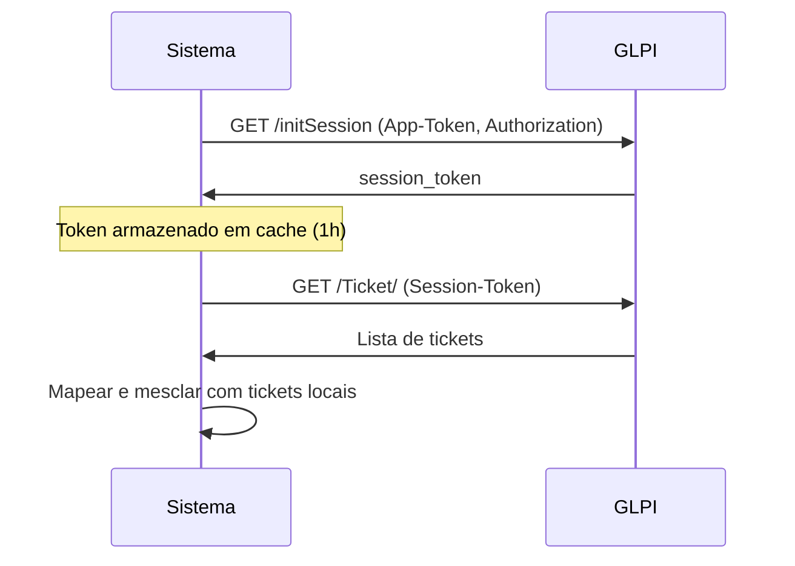

# Integração GLPI - Documentação

## Visão Geral

Este sistema agora possui integração com a API do GLPI, permitindo que administradores e agentes visualizem tickets do GLPI junto com tickets locais em uma única interface unificada.

## Características da Integração

- **Modo Somente Leitura**: Tickets do GLPI são exibidos mas não podem ser editados através desta interface
- **Consulta em Tempo Real**: Tickets são buscados do GLPI toda vez que a página é carregada
- **Mapeamento Automático de Status**: Status numéricos do GLPI são convertidos para os status locais
- **Cache de Sessão**: Session tokens do GLPI são reutilizados para melhor performance
- **Tratamento de Erros**: Se o GLPI estiver indisponível, apenas tickets locais são exibidos

## Configuração

### Variáveis de Ambiente

Adicione as seguintes variáveis ao arquivo `.env`:

```env
GLPI_API_URL=http://192.168.0.120/glpi/apirest.php/
GLPI_APP_TOKEN=seu_app_token_aqui
GLPI_AUTH_TOKEN=seu_user_token_aqui
```

**Importante**: 
- `GLPI_API_URL` deve terminar com `/`
- `GLPI_APP_TOKEN` é obtido nas configurações do GLPI (Setup > General > API)
- `GLPI_AUTH_TOKEN` é o token do usuário GLPI que será usado para autenticação

### Obtendo os Tokens no GLPI

1. **App Token**:
   - Acesse `Setup > General > API`
   - Na seção "API clients", clique em "Add"
   - Configure o aplicativo e copie o token gerado

2. **User Token**:
   - Faça login como o usuário que terá acesso à API
   - Vá em `Meu Perfil > Configurações > Tokens da API remota`
   - Clique em "Add" e copie o token gerado

## Como Funciona

### Fluxo de Autenticação



### Mapeamento de Status

O sistema mapeia automaticamente os status numéricos do GLPI:

| Status GLPI | Número | Status Local |
|-------------|--------|--------------|
| New         | 1      | open         |
| Processing  | 2      | in_progress  |
| Planning    | 3      | in_progress  |
| Pending     | 4      | in_progress  |
| Solved      | 5      | resolved     |
| Closed      | 6      | closed       |

### Mapeamento de Prioridade

| Prioridade GLPI | Número | Prioridade Local |
|-----------------|--------|------------------|
| Very Low        | 1      | low              |
| Low             | 2      | low              |
| Medium          | 3      | medium           |
| High            | 4      | high             |
| Very High       | 5      | critical         |

## Interface do Usuário

### Identificação Visual

Tickets do GLPI são identificados na interface por:

1. **Badge "GLPI"**: Badge laranja com ícone de link externo
2. **ID com Prefixo**: IDs de tickets GLPI são exibidos com prefixo "G" (ex: #G117)
3. **Não Clicável**: Cards de tickets GLPI não abrem detalhes (readonly)

### Permissões

- **Clientes**: Não veem tickets do GLPI (apenas seus próprios tickets locais)
- **Agentes e Admins**: Veem todos os tickets, incluindo os do GLPI

## Arquivos da Integração

### Backend

- **`server/glpi-client.ts`**: Cliente principal para comunicação com API GLPI
  - Gerenciamento de autenticação
  - Cache de session token
  - Mapeamento de dados
  - Tratamento de erros

- **`server/routes.ts`**: Endpoint modificado para mesclar tickets
  - Busca tickets locais do banco
  - Busca tickets do GLPI
  - Mescla e ordena resultados

### Schema

- **`shared/schema.ts`**: Tipos estendidos para suportar tickets GLPI
  - Campo `source`: 'local' | 'glpi'
  - Campo `externalId`: ID do ticket no sistema externo
  - Campo `glpiData`: Dados adicionais do GLPI

### Frontend

- **`client/src/pages/Tickets.tsx`**: Interface atualizada
  - Renderização condicional de badges
  - Desabilita interação com tickets GLPI
  - Exibição de IDs com prefixo

## Troubleshooting

### Tickets GLPI não aparecem

1. Verifique se as variáveis de ambiente estão configuradas corretamente
2. Confirme que o usuário logado é admin ou agente (clientes não veem tickets GLPI)
3. Verifique os logs do servidor para erros de conexão:
   ```
   [GLPI] Erro ao iniciar sessão: ...
   [GLPI] Erro ao buscar tickets: ...
   ```

### Erro de timeout

Se houver timeout nas requisições:
- Verifique conectividade de rede com o servidor GLPI
- O timeout padrão é 5 segundos e pode ser ajustado em `glpi-client.ts`

### Session expirada

O sistema detecta automaticamente sessões expiradas e renova o token.
Se problemas persistirem, verifique:
- Validade dos tokens configurados no `.env`
- Configurações de timeout de sessão no GLPI

## Limitações

1. **Somente Leitura**: Não é possível criar, editar ou deletar tickets do GLPI através desta interface
2. **Sem Mensagens**: Mensagens/followups de tickets GLPI não são exibidos
3. **Sem Anexos**: Anexos de tickets GLPI não são acessíveis
4. **Filtros Limitados**: Filtros complexos do GLPI não estão disponíveis

## Melhorias Futuras

Possíveis expansões da integração:

- [ ] Suporte para criar tickets no GLPI
- [ ] Visualização de mensagens/followups
- [ ] Download de anexos
- [ ] Sincronização bidirecional
- [ ] Webhook para atualizações em tempo real
- [ ] Cache de tickets GLPI com atualização periódica
- [ ] Filtros avançados específicos do GLPI
- [ ] Visualização de SLAs e prazos

## Segurança

- Tokens GLPI nunca são expostos ao frontend
- Session tokens são armazenados apenas na memória do servidor
- Conteúdo HTML dos tickets é sanitizado antes da exibição
- Autenticação é sempre revalidada antes de cada requisição

## Suporte

Para problemas relacionados à integração GLPI:
1. Verifique os logs do servidor
2. Confirme conectividade com o servidor GLPI
3. Valide os tokens de autenticação
4. Consulte a documentação oficial da API GLPI: https://github.com/glpi-project/glpi/blob/master/apirest.md
